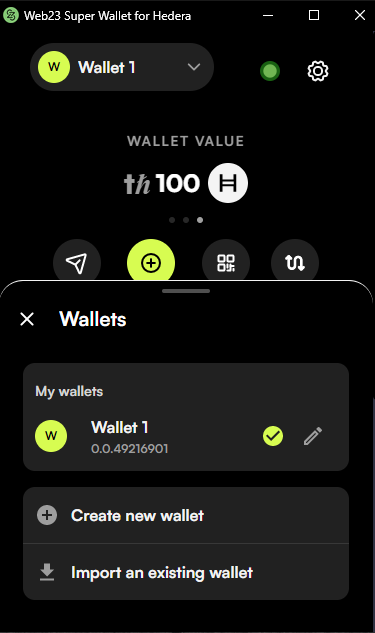

<a name="readme-top"></a>

<!-- PROJECT LOGO -->
<br />
<div align="center">
  <a href="/">
    
  </a>
  <h1 align="center">Hedera Test Wallet for Web23 company</h1>
</div>

<!-- TABLE OF CONTENTS -->
<details>
  <ol>
    <li>
      <a href="#about-the-project">About The Project</a>
    </li>
    <li>
      <a href="#getting-started">Getting Started</a>
      <ul>
        <li><a href="#system-requirements">System Requirements</a></li>
        <li><a href="#installation">Installation</a></li>
      </ul>
    </li>
  </ol>
</details>

<!-- ABOUT THE PROJECT -->

## About The Project

This is a simple proof of implementation for Hedera wallet chrome extension.

This application is built with React, Typescript, @hashgraph/sdk, hedera REST APIs and Material UI.
Context is used to handle the global state management and react-chrome-extension-router is leveraged for extension routing.

<!-- GETTING STARTED -->

## Getting Started

### System Requirements

- [NodeJS][node] v14 or greater
- [npm][npm] v6 or greater
- the .env file should include REACT_APP_API_ENDPOINT which indicates the backend server.

To verify things are set up
properly, you can run this:

```shell
node --version
npm --version
```

If you have trouble with any of these, learn more about the PATH environment variable and how to fix it.

### Installation

```js
npm install
```

### Build

```js
npm run build
```

### Run

After building, make sure that React generates `build` folder which contains chrome extension source files.

Go to `Manage extensions` of chrome extension menu, click `Load unpacked` to install the current source files(`build` folder) on Chrome browser.

## Implementation

- Create wallet
- Forget password
- Wallet should be signed via a password
- Send hbar
- Get private key
- Show nfts in the wallet
- Fetch Godaddy domains

## Caution

- All of information such as password, PrivateKey, PublicKey, mnemonic words(seeds), and Account ID are encrypted by AES in your default wallet app.
- According to the assessment requirements, I didn't implement that functionality so all the raw data are stored in localStorage without any encryption.

<br/>
<hr/>
<i>Anthony Jesus Toro Condor 12/12/2022</i>
